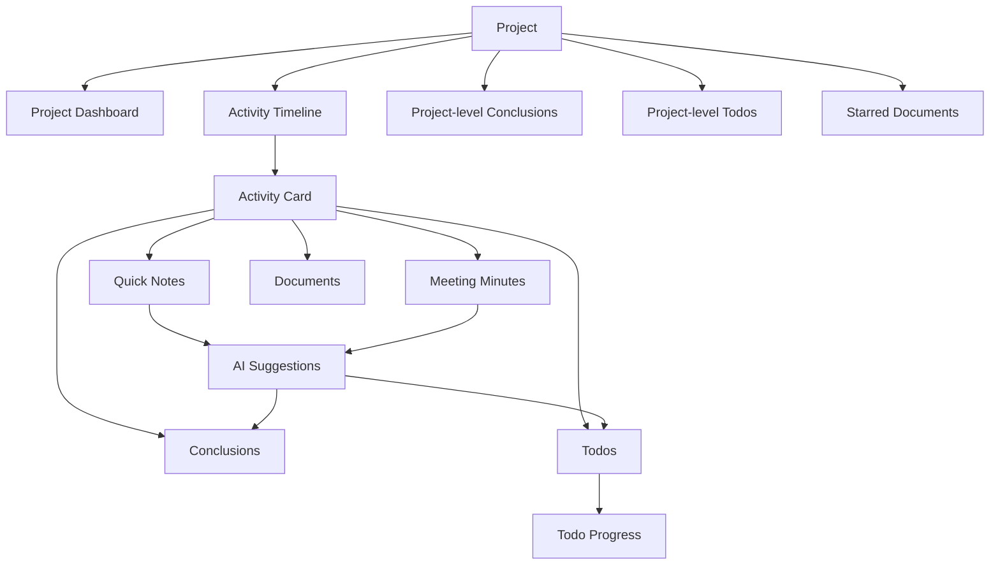

# 项目资料管理系统 Alpha UX 输出

## 1. 信息架构

## 2. 核心用户流

### 2.1 新建项目
1. 用户从顶部项目区点击新建项目。
2. 输入项目名称、状态与工作目录。
3. 系统创建数据库记录并在目标目录创建同名文件夹。
4. 页面自动切换到新项目首页。

### 2.2 新建活动并追加 quick note
1. 用户在项目首页点击新增活动。
2. 填写最少字段：分类、标题、时间。
3. 活动创建后默认展开，进入 quick note 输入区。
4. 用户连续追加 quick note，系统自动记录时间。
5. 活动保持 `未整理`，直到用户完成沉淀。

### 2.3 从活动中提炼 Conclusion / Todo
1. 用户在活动展开卡片中查看原始记录。
2. 用户手动新增结论或待办，或触发 AI 建议。
3. AI 候选项在建议区展示，逐条采纳才入正式数据。
4. 设为项目级可见的结论会同步上浮到项目首页。

### 2.4 在项目首页查看状态并继续推进
1. 用户进入项目首页先看到摘要、关键结论、未完成待办、标星文件。
2. 用户从未完成待办进入详情或直接切换状态。
3. 用户从最近活动列表定位上次讨论并继续更新。

### 2.5 更新待办进展
1. 用户打开 Todo 详情面板。
2. 查看来源活动、状态、优先级与最近进展。
3. 修改状态并追加一条进展记录。
4. 项目级未完成待办汇总自动刷新。

### 2.6 导入并标记关键文件
1. 用户在项目级或活动级点击导入文件。
2. 选择本地文件后，系统复制到项目受控目录。
3. 用户设置角色和标星状态。
4. 标星文件自动显示在项目首页。

## 3. 低保真页面说明

### 3.1 项目首页
- 顶部：项目切换、项目元信息、新建入口。
- 首屏主区：摘要、关键结论、未完成待办、标星文件三栏状态区。
- 次级区：最近活动时间线与项目级快捷操作。
- 左侧辅助列：项目状态、路径、活动统计、未整理提醒。

### 3.2 活动展开卡片
- 头部摘要：时间、分类、标题、未整理标记、固定展开控制。
- 主体四段：原始记录、结构化沉淀、文件区、AI 建议区。
- quick note 作为默认高频输入口，meeting minutes 单独展示。

### 3.3 新建活动弹窗
- 最少字段布局：分类、标题、时间。
- 默认聚焦标题或快速确认按钮。
- 提供“创建并开始记录”的主操作。

### 3.4 Todo 详情 / 进展面板
- 上部：标题、状态、优先级、来源活动。
- 中部：最近进展摘要。
- 下部：历史进展时间线与追加输入区。

### 3.5 文件导入 / 文件区
- 文件列表按关键资料与参考资料分组。
- 每项显示名称、来源活动、健康状态、标星与路径。
- 文件失效时显示明显提醒与重新定位按钮。

## 4. 状态清单

### 正常态
- 活动折叠态
- 活动展开态
- quick note 项
- meeting minutes 项
- conclusion 项
- todo 项
- 文件项

### 空态
- 无项目
- 无活动
- 无结论
- 无待办
- 无文件
- 无标星文件
- 无 AI 建议

### 异常态
- 文件失效
- 数据加载失败
- 表单提交失败
- 数据库初始化失败

### 特殊态
- 活动未整理
- 活动固定展开
- Todo 已完成 / 阻塞
- Document 已标星
- AI 候选项待确认

## 5. 组件优先级
1. App Shell / 项目切换
2. 项目首页状态区
3. 活动时间线与展开卡片
4. quick note / meeting minutes 编辑
5. Conclusion / Todo / TodoProgress
6. 文件管理
7. AI 建议区

## 6. Alpha 验收清单
- 可创建项目并生成本地目录
- 可创建活动并看到时间线
- quick note 可连续追加
- meeting minutes 可编辑保存
- conclusion / todo 可创建并汇总
- todo 进展可追踪
- 文件可复制导入、标角色、标星、显示失效
- AI 建议需确认后才入库
- 首页首屏以项目状态为主，不被原始记录淹没
