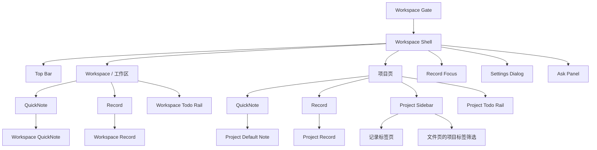

# Project Mind Alpha UX 基线

状态：当前正式基线  
更新时间：2026-08-23

## 1. UX 目标

当前产品的 UX 目标是让用户在一个本地工作区里稳定完成以下闭环：

1. 进入正确的工作区
2. 快速抓住当前最重要的信息
3. 在QuickNote里持续维护项目上下文
4. 在Record中保存更细的过程信息
5. 用 Todo、文件、引用和 AI 继续推进

仍然有效的方法论：

- `state before detail`
- `fast capture, deliberate structure`
- `layered information`
- `local confidence`

## 2. 当前信息架构

## 3. 当前页面职责

### 3.1 Workspace Gate

这是当前真正的起始页，而不是过渡弹窗。

它承担三件事：

- 打开已有工作区
- 创建新工作区
- 继续最近使用的工作区

### 3.2 Workspace / 工作区

Workspace 是工作区级中枢，不依赖 AI 是否可用而存在。

它承担四类任务：

- 回到整个工作区层面的视角
- 记录当前最重要的上下文
- 浏览工作区级Record
- 在 Workspace Todo Rail 中统一处理 Workspace Todo 与活跃 Project 的 Project Todo

当前设计关键点：

- 默认入口就是Workspace
- 左侧有工作区导航侧边栏
- 中间主区在 `QuickNote` 与 `Record` 间切换
- 右侧固定为工作区 Todo Rail
- Workspace 创建器默认创建 Workspace Todo；只有当次显式选择 Project 才创建 Project Todo
- Workspace Todo 使用 Workspace Tag；Project Todo 使用所属 Project 的 Project Tag
- 每条 Project Todo 显示来源 Project，Workspace Todo 显示 Workspace

### 3.3 项目页

项目页当前不再是“项目摘要 + 许多附属卡片”的旧式首页，而是：

- 一个可以持续维护的QuickNote
- 一个可以检索和编辑的项目Record区
- 一个承载记录与文件的项目侧边栏
- 一个固定可达、只显示当前 Project Todo 的 Project Todo Rail

### 3.4 Record Focus Page

单条记录需要更集中编辑时，使用专注页。

它的职责是：

- 放大记录正文编辑体验
- 保持与项目内标签、引用、联系人能力一致

### 3.5 顶栏

当前顶栏是工作区级工具带，而不是项目内工具条。

它承载：

- Workspace
- 项目页签
- Ask
- 全局搜索
- 归档项目
- 工作区菜单
- 设置

## 4. 当前核心用户流

### 4.1 打开工作区

1. 用户进入 Workspace Gate。
2. 打开已有工作区，或创建新工作区。
3. 进入 Workspace / 工作区。

### 4.2 记录当前背景与判断

1. 用户停留在Workspace `QuickNote` 视图。
2. 直接在 `Workspace QuickNote` 中输入内容。
3. 若需要沉淀到项目，可把选中文本追加到QuickNote。

### 4.3 查看工作区Record

1. 用户切到Workspace `Record`。
2. 搜索、浏览、新建、编辑工作区记录。
3. 用这些记录保存跨项目或未归档的工作痕迹。

### 4.4 维护项目主上下文

1. 用户从左侧项目页签或Workspace侧边栏打开项目。
2. 进入项目 `QuickNote`。
3. 在QuickNote里维护背景、判断、候选行动与引用。

### 4.5 保存更细的项目记录

1. 用户切到项目 `Record`。
2. 新建记录。
3. 添加标题、正文、标签。
4. 需要时进入记录专注页继续编辑。

### 4.6 管理 Todo

1. 用户在 Workspace Todo Rail 中统一查看 Workspace Todo 与活跃 Project 的 Project Todo，并通过来源标识理解真实归属。
2. Workspace 创建器默认创建 Workspace Todo；需要推进特定 Project 时，用户当次显式选择该 Project 创建 Project Todo。
3. 用户在 Project Todo Rail 中只查看和创建当前 Project 的 Project Todo。
4. Workspace Todo 使用 Workspace Tag，Project Todo 使用所属 Project 的 Project Tag；两类 Tag 即使同名也保持独立。
5. 用户用优先级、Subtask、Tag 与 Internal Reference 推进处理，并可从 Project Todo 的来源进入对应 Project。

### 4.7 管理文件

1. 用户在项目侧边栏切到 `文件` 标签页。
2. 导入或拖拽文件。
3. 为文件加标签、重命名、标星或新增版本。
4. 直接打开或在系统文件管理器中定位。

## 5. 展示层级原则

### 5.1 Workspace

Workspace 优先级是：

1. 当前最值得先抓住的判断
2. Workspace Todo 与活跃 Project 的 Project Todo 聚合队列
3. 工作区记录回看

因此：

- Workspace QuickNote 必须足够轻
- Workspace QuickNote 承载当前背景与判断
- Record不应压过当前工作上下文

### 5.2 Project

项目页优先级是：

1. 项目当前上下文
2. 记录沉淀
3. 文件材料
4. Todo 推进

因此：

- QuickNote是主场
- Record是补充视角
- 侧边栏承载导航与材料，不应喧宾夺主

### 5.3 Todo

Todo 当前不是独立大页面，而是持续可见的推进轨道。

因此：

- 应该尽量在原地完成状态切换与进展维护
- 不应把用户推离当前上下文太远

## 6. 当前交互特征

### 6.1 Workspace / Record双视图

Workspace 和 Project 都采用同一种双视图切换：

- `QuickNote`
- `Record`

目的：

- 让“当前状态”与“过程原始记录”分层
- 避免一个页面同时承担所有职责

### 6.2 侧边栏长期驻留

项目侧边栏和工作区侧边栏都是长期工具，不是临时弹层。

侧边栏职责：

- 快速定位
- 搜索
- 轻筛选
- 文件或记录入口管理

### 6.3 富文本作为主工作面

当前体验以富文本为主，不以表单字段为主。

体现为：

- Workspace QuickNote 是富文本
- QuickNote是富文本
- 记录正文是富文本

### 6.4 轻量结构化增强

结构化不是靠重表单实现，而是靠轻量能力叠加：

- `#标签`
- `[[内部引用]]`
- `@联系人`
- Todo 进展

## 7. 当前空态与边界体验

### 7.1 没有工作区

应显示完整 Workspace Gate，而不是空白壳。

### 7.2 没有项目

进入已打开 workspace 后，如果还没有项目：

- 仍然允许停留在Workspace
- 创建项目是建议动作，而不是强制前置

### 7.3 AI 不可用

AI 不可用时：

- Workspace 仍应可用
- Project 仍应可用
- Ask 应显示受控空态
- 不应让用户误以为主功能被锁死

## 8. 当前 UX 风险

- 工作区页右侧 Todo Rail 和中间主区在小窗口下的空间竞争较明显
- 项目页当前对“项目当前状态”的结构化摘要仍偏弱，更多依赖用户自己维护默认笔记
