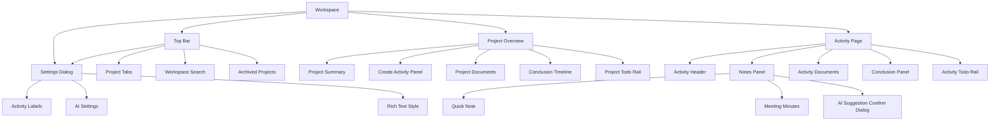

# Project Mind Alpha UX 基线

## 1. UX 目标

当前产品的 UX 目标不是“把所有信息都展示出来”，而是帮助用户完成以下闭环：

1. 快速进入正确的项目上下文
2. 在 Activity 中顺畅记录原始内容
3. 将记录沉淀为结论与 Todo
4. 在项目级持续看到当前状态
5. 低成本回到上一次讨论并继续推进

仍然有效、且已经映射到当前实现的方法论包括：

- `state before detail`
- `fast capture, deliberate structure`
- `layered information`
- `local confidence`

## 2. 当前信息架构

## 3. 当前路由与页面

### 3.1 Workspace Shell

当前工作台由统一外壳承载，包含：

- 顶部项目页签
- 工作台搜索
- 归档项目入口
- 设置入口
- 底部状态栏

### 3.2 Project Overview

当前项目页承担四类核心任务：

- 编辑项目摘要
- 创建新 Activity
- 查看项目级文件与结论时间线
- 通过右侧 Todo Rail 跟踪项目级 Todo

### 3.3 Activity Page

当前 Activity 页是“记录与沉淀”的主工作面，分为：

- 页面头部
  - 项目名
  - Activity 标题
  - 活动属性
  - 活动状态
  - 时间
- 左列 Notes Panel
  - 编辑当前记录
  - 浏览其他记录
  - 触发 AI 提炼
- 右列 Details
  - Activity 文件区
  - 结论区
- 右侧 Todo Rail
  - 创建和推进当前 Activity 的 Todo

### 3.4 Settings

当前设置面板包含三个真实分区：

- 活动标签
- AI 设置
- 富文本样式

## 4. 当前核心用户流

### 4.1 新建项目

1. 用户从顶部页签区点击“新建”。
2. 在弹窗中填写项目名称、状态、工作目录和摘要。
3. 系统创建项目记录并生成本地项目目录。
4. 页面自动跳转到项目总览页。

### 4.2 在项目页创建 Activity

1. 用户进入项目页。
2. 在项目摘要区下方展开“新增 Activity”面板。
3. 填写：
   - 活动属性，可空
   - 标题
   - 时间
4. 点击“创建并进入记录”。
5. 页面进入对应 Activity。

### 4.3 在 Activity 中记录 Note

1. 用户进入 Activity 页左侧记录区。
2. 选择或切换当前记录类型：
   - quick note
   - meeting minutes
3. 在富文本编辑器内持续记录内容。
4. 右侧“其他记录”区域用于切换已有记录或未保存草稿。

### 4.4 通过 AI 提炼记录

1. 用户在某条已保存记录上触发 AI 提炼。
2. 系统基于该 Note 生成候选结论与候选 Todo。
3. 弹出确认对话框，展示两组候选项。
4. 用户确认后，候选项写入当前 Activity。

### 4.5 手动沉淀结论

1. 用户在 Activity 页右侧“结论”区点击“新增结论”。
2. 系统在当前区块内展开结论 composer。
3. 用户输入结论内容，并选择是否“提升到项目首页”。
4. 保存后：
   - 当前 Activity 中可见
   - 如已提升，则项目页结论时间线中可见

### 4.6 管理项目级与 Activity 级 Todo

1. 用户在项目页或 Activity 页右侧 Todo Rail 中创建 Todo。
2. 输入待办内容并选择优先级。
3. 后续可直接在 Rail 中：
   - 切换状态
   - 修改内容
   - 追加进展
4. 未完成与已完成 Todo 分开展示。

### 4.7 导入和管理文件

1. 用户在项目或 Activity 的文件区点击“导入文件”或直接拖拽文件。
2. 系统将文件复制到项目受控目录。
3. 文件进入对应上下文列表。
4. 用户可：
   - 点击打开文件
   - 双击文件名重命名
   - 标星 / 取消标星
5. 若托管路径失效，文件会显示“失效”状态。

### 4.8 搜索并跳转

1. 用户在顶部搜索框输入关键词。
2. 搜索结果按对象类型分组展示。
3. 用户选择结果后跳转到：
   - 项目总览
   - Activity
   - 对应锚点位置

### 4.9 调整本地设置

1. 用户从顶部设置入口打开设置对话框。
2. 可调整：
   - 活动属性 / 状态字典
   - AI provider 与能力绑定
   - 富文本排版样式
3. 修改即时作用于当前本地 workspace。

## 5. 页面层级与展示原则

### 5.1 Project Overview

首页应优先呈现项目状态，而不是铺满原始记录。

当前信息优先级为：

1. 项目名称与摘要
2. 新建 Activity 入口
3. 项目级文件区
4. 结论时间线
5. 项目 Todo Rail

### 5.2 Activity Page

Activity 页强调“先记录，再沉淀”。

当前层级为：

1. Activity 头部上下文
2. Notes Panel
3. 文件区与结论区
4. Todo Rail

### 5.3 Settings

设置不承担日常工作流，只承担配置和系统级调优。

因此当前设计保持：

- 左侧导航清晰
- 右侧内容单焦点
- 不和主业务流程混在同一页面

## 6. 当前状态清单

### 6.1 空态

- 无项目
- 项目下无 Activity
- 项目下无文件
- 项目下无结论
- Activity 下无文件
- Activity 下无结论
- Notes Panel 无其他记录
- 搜索无结果
- AI 候选为空

### 6.2 加载态

- 工作台项目加载中
- 项目总览加载中
- Activity 加载中
- 设置面板加载中
- AI 生成中

### 6.3 错误态

- 创建项目失败
- 保存摘要失败
- 保存记录失败
- AI 连通性测试失败
- AI 候选写入失败
- 文件打开失败
- 文件导入失败
- 数据加载失败

### 6.4 特殊业务态

- 归档项目
- Document 已标星
- Document 失效
- AI 候选待确认
- 富文本样式同步中

## 7. 当前 UX 边界

为了与现状保持一致，以下内容不作为当前 UX 的既有能力描述：

- 不写活动分类流程
- 不写文件角色管理流程
- 不写项目级直接新增结论流程
- 不写 Todo 多状态看板流程
- 不写文档版本历史浏览流程
- 不写 AI assistant / summary 独立工作流
- 不写文件失效后的完整重定位交互

## 8. 后续 UX 优先演进方向

未来 `1` 到 `2` 个版本内，UX 优先对齐以下优化方向：

- 把 AI 从单次同步动作升级为可感知状态的作业流
- 降低页面内业务编排复杂度，增强主流程的一致性
- 补齐“失效文件修复”和“版本历史”这类已建模但未完整暴露的能力
- 继续保持项目页看状态、Activity 页做沉淀、设置页做配置的结构边界
