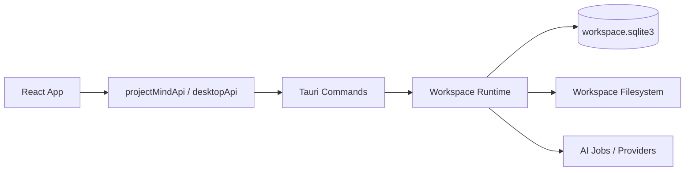

# Project Mind System Design

状态：当前正式基线  
更新时间：2026-08-25

## 1. 架构摘要

Project Mind 当前是一个 `workspace-first` 的本地桌面应用，采用以下主技术栈：

- `Tauri 2`
- `React 19`
- `TypeScript`
- `React Query`
- `Zustand`
- `Tailwind CSS v4`
- `SQLite`

当前系统可以概括为五个核心运行单元：

1. `React Workspace Shell`
2. `Typed Service Layer`
3. `Tauri Command Host`
4. `Workspace Runtime + SQLite + Managed Filesystem`
5. `AI Job / Provider Layer`



## 2. Workspace 与存储边界

### 2.1 Workspace 文件结构

每个 workspace 都是一个真实目录：

```text
<workspace-root>/
  .project-mind/
    workspace.json
    workspace.sqlite3
    cache/ai/
    logs/
    tmp/
  <Project A>/
  <Project B>/
```

约束：

- `workspace.json` 保存工作区元信息与安全模式相关数据
- `workspace.sqlite3` 是主业务数据库
- AI 缓存、日志、临时文件都跟随 workspace
- 项目目录直接落在 workspace 根目录，而不是系统 app data

### 2.2 文件落位

当前文件系统策略是“用户能看到项目文件，系统元数据尽量隐藏”：

- 项目导入文件默认进入对应项目目录
- 记录中托管图片进入 `<project-root>/.project-mind/embedded-note-assets/`
- 文件历史版本进入该文件对应的 `history_dir_path`

### 2.3 路径可迁移性

路径持久化遵循以下强制规则：

- Workspace 自有的托管文件引用必须以相对于 Workspace 或 Project 业务作用域根目录的路径持久化，禁止写入机器相关的绝对路径。
- SQLite 路径字段使用 `workspace:<relative-path>` 作为 Workspace 内文件的规范形式；富文本中的托管图片和附件使用作用域相对路径，例如 `.project-mind/embedded-note-assets/image.png`。
- SQLite、富文本 HTML、Workspace 元数据、设置、缓存和导出元数据都不得持久化 Unix 用户目录路径、Windows 盘符路径、UNC 路径、`file://` URI 或 Tauri `asset:` URL。
- Tauri command / API 只允许在读取后的运行时边界临时还原绝对路径。任何回写都必须先重新规范化，不能把已还原路径直接写回持久层。
- 无法证明属于当前 Workspace 的本地绝对资源引用不得原样保留；写入边界应清空无效引用，避免制造不可迁移数据。远程 HTTP(S) URL 与内嵌 `data:` URL 不属于文件系统路径。

明确例外仅有两类：

- 外部导入源的 `original_path` 可以用显式的 `absolute:` 形式记录，因为它描述 Workspace 外部来源；托管副本的 `managed_path` 仍必须使用 `workspace:` 相对形式。
- 应用本机的 `Local Session` 可以保存最近打开的 Workspace 根目录，以便重新发现 Workspace；该文件不属于 Workspace 数据，也不得被复制进 Workspace。

重命名规则：

- Project 改名只移动 Project 目录和更新结构化路径字段；相对富文本资源引用保持不变，不做基于旧 Project 名的全文路径重写。
- 仓库 Markdown 链接必须使用仓库相对路径。`npm run check:portable-paths` 负责阻止机器本地绝对路径重新进入文档。

### 2.4 历史数据库兼容边界

- 全新工作区不创建历史领域表、状态选项或关联列；只有检测到旧数据库时才补齐迁移所需的最小兼容结构。
- v21 在一个 Savepoint 内把仍存在的历史 Brief 与结论复制为 Project Record，并用来源 Tag 和 `legacy_domain_record_migrations` 保存映射；失败会完整回滚后重试。
- 对已运行旧 v13 迁移的工作区，v21 会识别并复用当时生成的 Brief Record，避免重复。旧 v13 在此前版本中已经删除的结论无法由本版本恢复；除此之外，v21 不删除或清空任何现存历史行及关联。
- 升级前仍会按 schema 版本创建数据库备份；当前命令、搜索和页面不会读取历史领域对象。

### 2.5 会话与 secrets

本地状态分成两层：

- `Workspace Metadata`
  - 跟随 workspace 存储
  - 管理工作区本身的安全模式
- `Local Session`
  - 保存在本机
  - 用于记录最近工作区和部分 UI 持久偏好

当前 AI 密钥策略：

- 已保存的 API Key 默认锁定
- 需要用户输入 workspace 密码执行解锁
- 解锁状态通过 `workspace_status_get` 与 `ai_settings_get` 反映

## 3. 当前前端结构

### 3.1 路由层

当前主路由定义在 [src/main.tsx](../src/main.tsx)：

- `/workspace`
- `/projects/:projectId`
- `/projects/:projectId/summary`
- `/projects/:projectId/records/:noteId`
- `/settings/:section`

说明：

- 默认入口会重定向到 `/workspace`
- `summary` 路由当前主要承担兼容跳转职责

### 3.2 Workspace Shell

入口位于 [src/App.tsx](../src/App.tsx)。

职责：

- Workspace Gate 与已进入工作区后的主 shell 切换
- 顶栏、项目侧边栏、状态栏、Toast、设置对话框的全局挂载
- 工作区切换后清理 scoped query 和 AI job 同步
- 根据当前路由决定主页面内容

当前 shell 级关键查询包括：

- `["workspace-status"]`
- `["projects", "all"]`
- `["ai-settings"]`
- `["rich-text-style"]`
- `["overview", projectId]`
- `["workspace-overview"]`

### 3.3 页面层

当前正式主页面包括：

- [src/components/workspace/WorkspacePage.tsx](../src/components/workspace/WorkspacePage.tsx)
- [src/components/project/ProjectQuickNotePage.tsx](../src/components/project/ProjectQuickNotePage.tsx)
- [src/components/project/ProjectNoteFocusPage.tsx](../src/components/project/ProjectNoteFocusPage.tsx)

职责：

- 组织页面级查询、变更与布局
- 决定 overview / history 模式
- 组合富文本、Todo、文件、AI 等模块

### 3.4 组件与交互胶水层

当前 feature 组件主要分布在：

- `src/components/layout/*`
- `src/components/workspace/*`
- `src/components/project/*`
- `src/components/todo/*`
- `src/components/document/*`
- `src/components/rich-editor/*`
- `src/components/ai/*`
- `src/components/settings/*`

常见职责：

- 页面内局部布局
- 富文本编辑器扩展
- 文件导入流程
- 标签与联系人补全
- Todo 进展交互

### 3.5 状态层

当前状态划分如下：

- `React Query`
  - 持久业务实体
  - 远近端命令结果缓存
- `Zustand`
  - UI 临时态与持久偏好
- `AI job sync`
  - 运行中 AI 作业状态

主要 store：

- [src/state/ui-store.ts](../src/state/ui-store.ts)
- `feedback-store`
- `ai-job-store`

`ui-store` 当前持久化的关键偏好包括：

- 记录编辑宽度
- 页面宽度模式
- Todo Rail 宽度
- 项目侧边栏宽度

### 3.6 项目页签驻留与缓存

项目 Overview 页采用浏览器式三态模型：

- `Active`：当前可见页，完整运行。
- `Warm`：最近两个项目页保留 React 与编辑器现场，页面设置为 `inert`，并暂停页面级查询。
- `Cold`：只保留 React Query 数据、最近路由和持久化 UI 状态，页面实例被回收。

驻留顺序由 `useResidentProjectPages` 管理，使用有界 LRU，完整驻留项目页最多三个。项目页签在 pointer hover 或 keyboard focus 时预取项目聚合数据与标签设置；Cold 页切换时同步纳入当前渲染，避免等待 effect 造成空白帧。

Workspace Overview 由 `useResidentWorkspacePage` 独立管理。它在首次访问后作为 `Pinned` 页面常驻，不参与项目 LRU 和页面数量回收；只在 workspace 作用域被清理或页面缓存被禁用时卸载。

React Query 的 query key 统一定义在 `src/lib/queryKeys.ts`。默认数据新鲜期为 15 秒、GC 时间为 10 分钟；窗口聚焦、网络重连和重新挂载不会隐式刷新。详细约束见 `docs/cache-strategy.md`。

Project Record Focus 的强制保存由 Workspace 范围的 `RecordSaveCoordinator` 承担。页面离开前只捕获最新 Committed Content 快照并立即导航；coordinator 在页面卸载后继续处理 managed image、持久化、同 Record 排序、失败保留与 React Query 最新结果同步。正常退出、Workspace 切换和更新安装会先 flush 当前 Workspace 队列。

图片标注、Record Focus 页面和非默认设置面板通过 dynamic import 加载。生产构建使用 `check:bundle-boundaries` 防止 Canvas 重新进入启动预加载，并限制主入口脚本不超过 250 KiB。

## 4. Service Layer

### 4.1 desktopApi

位于 [src/services/desktopApi.ts](../src/services/desktopApi.ts)。

职责：

- 封装 Tauri `invoke`
- 打开文件与目录
- 选择目录与文件
- Reveal 到系统文件管理器

### 4.2 projectMindApi

位于 [src/services/projectMindApi.ts](../src/services/projectMindApi.ts)。

职责：

- 作为前端唯一 typed command wrapper
- 统一把 TS 输入映射到 Tauri command
- 收敛业务命令命名

当前主要命令分组：

- workspace 生命周期
- projects / overview
- notes / workspace notes
- todos
- documents / project tags
- contacts
- AI editor skills / jobs / settings
- rich text style

## 5. 当前数据模型摘要

核心类型定义位于 [src/lib/types.ts](../src/lib/types.ts)。

当前正式主模型包括：

- `ProjectRecord`
- `NoteRecord`
- `WorkspaceNoteRecord`
- `TodoRecord`
- `TodoProgressRecord`
- `DocumentRecord`
- `ProjectTagRecord`
- `ContactRecord`
- `AiSettingsSnapshot`

当前页面聚合结果是 `ProjectPageData` 与 `WorkspacePageData`，页面只消费 Record、Document 与 Todo 等现行对象。

## 6. 富文本与引用体系

当前富文本由 `RichEditor` 承担，支持以下关键能力：

- Markdown / HTML 双表示
- 内部引用 `[[...]]`
- 联系人提及 `@...`
- 标签触发与补全
- 图片与附件相关扩展
- 选区级 AI 改写动作

当前使用范围：

- Workspace QuickNote
- Workspace Record
- Project 默认笔记
- Project Record

## 7. 文件管理链路

文件相关能力主要由以下部分组成：

- `useDocumentImportFlow`
- `useDocumentMutations`
- `ProjectSidebar`
- `DocumentImportTagDialog`

典型流程：

1. 选择或拖拽文件
2. 打开导入前标签对话框
3. 调用 `document_import`
4. 刷新项目 overview 与标签设置
5. 在侧边栏文件页中继续使用项目标签

## 8. AI 架构

### 8.1 当前 AI 能力

当前正式暴露的 AI 能力包括：

- 可配置的 AI Editor Skill，包括文字改写、解释与图片文字提取；技能可单独选择模型，也可继承默认模型角色。
- Record 的 AI Metadata Fill；它使用通用默认模型，通过独立 `record_metadata` Job 从 Committed Content 生成标题与同作用域 Tag 建议，并由原子命令写入。

### 8.2 Job 模式

`Editor Skill Job` 通过统一机制执行，特点：

- 前端 enqueue
- 轮询或同步 job target
- 读取 job result
- 同步到 UI

## 9. 当前系统边界

### 9.1 已成立边界

- 工作区是唯一持久上下文边界
- 前端只通过 typed service 访问后端
- SQLite 是当前唯一业务真相源
- 文件与数据库共同构成可迁移工作区

### 9.2 暂不保证的边界

- 历史数据库结构只保证无损升级和来源追溯，不再提供旧对象的业务 API
- 跨平台桌面兼容性尚未做完备验收
