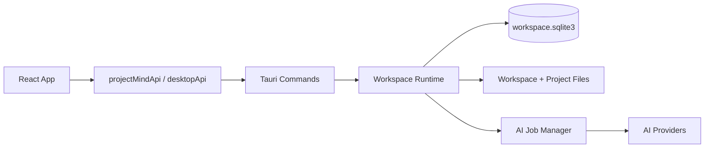

# Project Mind System Design

状态：当前正式基线  
更新时间：2026-04-12

## 1. 架构摘要

Project Mind 当前是一个 `workspace-first` 的本地桌面应用，采用如下主技术栈：

- `Tauri 2`
- `React 19`
- `TypeScript`
- `React Query`
- `Zustand`
- `Tailwind CSS v4`
- `SQLite`

系统当前由五个核心运行单元组成：

1. `React Workspace Shell`
2. `Tauri Command Host`
3. `Workspace Runtime`
4. `SQLite + Managed Filesystem`
5. `AI Job Manager`

高层关系如下：



## 2. Workspace 与存储模型

### 2.1 Workspace 文件结构

当前每个 Workspace 都是一个真实目录，关键内部结构如下：

```text
<workspace-root>/
  .project-mind/
    workspace.json
    workspace.sqlite3
    cache/ai/
    logs/
    tmp/
  <Project A>/
  <Project B>/
```

约束：

- `workspace.json` 保存 Workspace 元数据与密码校验信息
- `workspace.sqlite3` 保存主业务数据
- `cache/ai`、`logs`、`tmp` 只服务当前 Workspace
- 项目目录直接落在 Workspace 根目录下，不单独挂到系统 app data

### 2.2 项目目录与附件落位

当前文件系统落位采用“项目目录可见、系统元数据隐藏”的方式：

- 项目级导入文件默认进入 `<project-root>/`
- Activity 级导入文件默认进入 `<project-root>/<activity-folder>/`
- 记录内嵌图片进入 `<project-root>/.project-mind/embedded-note-assets/`
- 文档历史版本进入文档对应的 `history_dir_path`

含义：

- 用户可以直接在 Finder / Explorer 中看到项目文件和 Activity 目录
- 记录内部生成的托管图片不会污染主目录结构
- 复制整个 Workspace 可以把数据库、配置和文件一起迁移

### 2.3 本地会话与安全

安全与本地会话分成两层：

- `Workspace Metadata`
  - 保存在 Workspace 内
  - 当前固定安全模式是 `workspace_password_encrypted`
  - 使用密码哈希校验打开后的解锁行为
- `Local Session`
  - 保存在系统 app data 下的 `workspace-session.json`
  - 只保存最近使用的 Workspace 路径和最后打开记录
  - 不保存业务数据库

当前 AI 密钥策略：

- 打开 Workspace 时不会自动解锁已保存密钥
- 用户需要显式输入 Workspace 密码执行 `workspace_unlock`
- `secret_crypto.rs` 使用 Workspace 密码派生密钥，对 API Key 做加密存储

## 3. 前端分层

### 3.1 App Shell

入口在：

- `src/main.tsx`
- `src/App.tsx`

职责：

- QueryClient 注入
- Workspace Gate 与 Workspace Layout 切换
- 顶部工作台、项目侧栏、状态栏、toast、设置、Ask 的全局挂载
- 依据当前路由决定 `Project`、`Activity`、`Today` 三类主页面

当前关键查询包括：

- `["workspace-status"]`
- `["projects", "all"]`
- `["ai-settings"]`
- `["rich-text-style"]`

### 3.2 Screen / Feature Layer

当前主要包括：

- `src/components/project/*`
- `src/components/activity/*`
- `src/components/document/*`
- `src/components/todo/*`
- `src/components/ai/*`
- `src/components/layout/*`
- `src/components/settings/*`
- `src/components/today/*`

职责：

- 页面内容编排
- 局部工作流组合
- Query / mutation / store / service 的组织

当前典型 feature：

- `ProjectOverviewPage`
- `ActivityPage`
- `ActivityNotesPanel`
- `ManagedDocumentSection`
- `TodoRail`
- `AiArtifactCard`
- `AskPanel`

### 3.3 Hooks / Orchestration Layer

当前 hooks 层承担“把命令、缓存、交互胶水收敛到页面外”的职责，典型文件包括：

- `src/hooks/useActivityMutations.ts`
- `src/hooks/useDocumentMutations.ts`
- `src/hooks/useDocumentImportFlow.ts`
- `src/hooks/useTodoMutations.ts`
- `src/hooks/useWindowFileDrop.ts`
- `src/hooks/useDismissOnOutside.ts`
- `src/hooks/useExclusiveActivation.ts`

职责：

- 封装 mutation 成功后的缓存刷新
- 封装文件导入、拖拽、标签选择等跨组件流程
- 封装短驻留弹层、唯一激活对象等交互状态

### 3.4 Service Layer

位于：

- `src/services/desktopApi.ts`
- `src/services/projectMindApi.ts`

职责：

- `desktopApi`
  - 封装 `invoke`
  - 目录 / 文件选择
  - 打开文件、打开目录、Reveal、读取 Data URL
- `projectMindApi`
  - 作为唯一 typed command wrapper
  - 负责把前端输入映射到 Tauri command 名称

### 3.5 UI / State Layer

UI primitives 位于：

- `src/ui/components/*`
- `src/ui/lib/cn.ts`
- `src/styles/app.css`

状态层位于：

- `src/state/ui-store.ts`
- `src/state/feedback-store.ts`
- `src/state/ai-job-store.ts`

边界：

- 持久实体列表交给 React Query
- UI 临时态交给 Zustand
- AI 作业状态通过事件同步进 `ai-job-store`

## 4. 后端分层

### 4.1 Tauri Command Host

入口位于：

- `src-tauri/src/lib.rs`

职责：

- 注册全部 `#[tauri::command]`
- 初始化 `AppState`
- 自动尝试恢复上次打开的 Workspace
- 暴露桌面能力、Workspace 生命周期、业务 CRUD、AI 能力、搜索能力

当前命令大致分为六组：

- Desktop：打开文件 / 打开目录 / Reveal / Data URL
- Workspace：状态、创建、打开、解锁、锁定
- Domain CRUD：Project / Activity / Note / Conclusion / Todo / Document
- Settings：活动标签、文件标签、记录类型、富文本样式、AI 设置
- AI Runtime：生成建议、刷新 Artifact、Ask、测试 Profile、绑定能力
- Infra：AI Job enqueue / get / list active、workspace search

### 4.2 Workspace Runtime

`AppState` 当前只维护一个活动中的 `WorkspaceRuntime`。

`WorkspaceRuntime` 内部包含：

- `summary`
- `metadata`
- `paths`
- `secret_state`
- `db: Mutex<Database>`
- `ai_jobs: AiJobManager`

设计含义：

- 当前应用同一时刻只有一个活动 Workspace
- 数据库连接和 AI 作业都与当前 Workspace 绑定
- 锁定 / 解锁 AI secrets 会重建数据库实例，使后端重新获得或失去解密能力

### 4.3 Database Layer

位于：

- `src-tauri/src/db.rs`

当前 `Database` 仍是“repository + domain service + file service”混合体，主要负责：

- schema 初始化与迁移
- Project / Activity / Note / Conclusion / Todo / Document CRUD
- 文件复制、版本归档、路径重命名、回收站删除
- 文件标签与记录类型字典
- AI 配置、绑定、开关、并发设置
- AI Suggestion / Artifact / Ask 的数据准备与落库
- Workspace search
- demo workspace seed

当前核心表包括：

- `projects`
- `activities`
- `notes`
- `conclusions`
- `todos`
- `todo_progresses`
- `documents`
- `document_versions`
- `file_tag_options`
- `record_type_options`
- `document_tag_links`
- `ai_suggestions`
- `ai_provider_profiles`
- `ai_capability_bindings`
- `ai_artifacts`
- `ai_artifact_citations`
- `app_settings`

### 4.4 AI Job Manager

位于：

- `src-tauri/src/ai_jobs.rs`

职责：

- 维护作业状态：`queued / running / succeeded / failed`
- 控制并发 `1..4`
- 为 Artifact Refresh、Ask、Note Suggestions、Profile Test 提供统一异步执行模型
- 通过 `ai-job-updated` 事件向前端推送状态

前端配套位于：

- `src/lib/aiJobs.ts`
- `src/state/ai-job-store.ts`

当前特征：

- 作业快照存于内存，不跨应用重启持久化
- Artifact refresh 会按 `targetKey` 做去重，避免同一目标重复排队

## 5. 核心数据流

### 5.1 打开 Workspace

1. 前端调用 `workspace_status_get` 判断是否已有活动 Workspace。
2. 用户选择打开或新建 Workspace。
3. `workspace.rs` 负责读取 / 创建 `workspace.json` 和目录结构。
4. `AppState` 创建新的 `WorkspaceRuntime`。
5. React Query 刷新 Workspace 级查询，前端进入正常页面壳。

### 5.2 常规 CRUD 流

1. Feature 组件发起 query 或 mutation。
2. 调用进入 `projectMindApi`。
3. `projectMindApi` 通过 `desktopApi.command` 调用 Tauri command。
4. `lib.rs` 把请求路由给 `Database`。
5. `Database` 完成 SQLite 写入、文件系统操作和必要的级联触达。
6. 前端通过 React Query 失效或直接 patch cache 刷新视图。

### 5.3 文件导入与记录资源流

1. 页面或原生窗口拖拽进入 `useDocumentImportFlow`。
2. 如果已有文件标签字典，先弹出 `DocumentImportTagDialog`。
3. 前端调用 `document_import` 或剪贴板图片导入命令。
4. `Database` 决定目标目录、复制文件、写入 `documents` 和 `document_versions`。
5. 前端刷新项目 / Activity / 文件标签缓存。

### 5.4 AI 作业流

1. 前端通过 `enqueueAndWait` 提交 `AiJobEnqueueInput`。
2. `AiJobManager` 创建作业快照并进入队列。
3. 后台线程重新打开 `Database`，执行对应 AI 任务。
4. 作业状态通过 `ai-job-updated` 推送到前端。
5. `ai-job-store` 更新后，页面读取最新作业结果并回填 React Query cache。

## 6. 边界约束

### 6.1 React Query 与 Zustand 的分工

- React Query 负责 Workspace 持久实体和查询缓存
- Zustand 负责：
  - modal / rail / settings 等 UI 态
  - feedback / toast
  - AI 作业快照

禁止把实体列表长期复制到 Zustand 作为第二事实源。

### 6.2 Tauri 依赖边界

理想边界仍然是“业务 feature 不直接接触 Tauri”，但当前代码已有两个基础设施例外：

- `src/lib/aiJobs.ts`
- `src/hooks/useWindowFileDrop.ts`

因此当前真实约束应理解为：

- 页面业务组件不直接调用 Tauri API
- 原生事件监听只允许收敛在基础设施 helper / service 中

### 6.3 样式边界

- `src/styles/app.css` 是唯一全局 token 入口
- 页面样式通过 Tailwind utility 组合
- UI primitives 是正式视觉 API
- 业务页面不应自建第二套按钮 / 卡片体系

## 7. 质量门槛

当前常用验证命令为：

- `npm run build`
- `npm run test:unit`
- `npm run check:ui-standards`
- `cargo check --manifest-path src-tauri/Cargo.toml`

其中 `check:ui-standards` 当前目标是拦截：

- 旧 token 命名回流
- 非 Lucide 图标库
- 硬编码颜色
- 设计系统旧命名残留

注意：

- 当前分支上的 Tauri 调用边界与 `check-ui-standards` 脚本仍有漂移，脚本规则需要后续继续和真实架构对齐

## 8. 当前技术债

当前最明显的结构性技术债包括：

- `src-tauri/src/db.rs` 体量过大，承担了过多混合职责
- 前端缓存失效策略仍偏手工，页面内存在较多 `invalidateQueries`
- Tauri 边界虽然大体收敛，但事件和窗口能力仍有少量 infra 级例外
- AI 作业当前只保存内存态，没有独立的持久化作业历史

后续若继续演进，应优先在现有边界基础上拆分，而不是重建另一套运行时模型。
